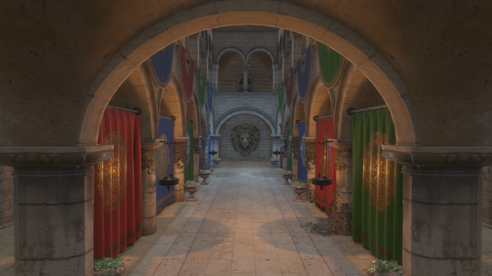

# OpenGL Renderer

[](https://github.com/rthrh/opengl-renderer/actions/workflows/ci.yml)

A real-time PBR renderer written in modern C++, mostly based on [LearnOpenGL](https://learnopengl.com/) and [OGLdev](https://ogldev.org/index.html),
targeting desktop (Linux/Windows) and WebAssembly through Emscripten

**[Live web demo](https://rthrh.github.io/openglrenderer/)**



## Features
- **Physically Based Rendering (PBR) shading**
- **Image Based Lighting (IBL)**
- **Physically Based Bloom**
- **Light types**: directional, point and spot lights
- **Real-time shadows**: with PCSS for spot lights and Poisson disk/sphere PCF kernel for directional and point lights
- **Screen Space Ambient Occlusion (SSAO)**
- **Fast Approximate Anti-Aliasing (FXAA)**
- **Deferred pipeline**: for opaque and masked meshes
- **Forward pipeline**: for blend meshes
- **glTF model loading**: with ASSIMP
- **Shader hot reload**: shaders recompile on file changed while app is running (desktop only)

## Demo controls
- Click on canvas to enter camera mode. Esc to switch to UI mode
- WASD and mouse to move

## Building

### Prerequisites

- CMake 3.14+
- C++23-capable compiler (GCC 13+, Clang 16+, MSVC 19.36+)
- For web builds: [Emscripten](https://emscripten.org/) 5.0.7+

### Linux

```bash
sudo apt install libwayland-dev libxkbcommon-dev wayland-protocols \
    libx11-dev libxrandr-dev libxinerama-dev libxi-dev libxcursor-dev \
    libgl1-mesa-dev

git clone --recursive https://github.com/rthrh/opengl-renderer.git
cd opengl-renderer
cmake -B build -DCMAKE_BUILD_TYPE=Release
cmake --build build -j
./build/opengl-renderer
```

### Windows

```bash
git clone --recursive https://github.com/rthrh/opengl-renderer.git
cd opengl-renderer
cmake -B build -G "Visual Studio 17 2022"
cmake --build build --config Release
build\Release\opengl-renderer.exe
```

### Web (WebAssembly)

```bash
# After installing and activating Emscripten:
emcmake cmake -B build-wasm -DCMAKE_BUILD_TYPE=Release
cmake --build build-wasm -j
emrun --port 8000 build-wasm/opengl-renderer.html
```

## Dependencies
All provided via submodules or headers in `deps/`:

- [GLFW](https://github.com/glfw/glfw) - window creation
- [GLAD](https://glad.dav1d.de/) - GL loader-generator
- [GLM](https://github.com/g-truc/glm) - matrix math
- [Assimp](https://github.com/assimp/assimp) - model loading
- [Dear ImGui](https://github.com/ocornut/imgui) - GUI
- [stb_image](https://github.com/nothings/stb) - image loading
- [tinyexr](https://github.com/syoyo/tinyexr) - EXR HDR image loading

## Acknowledgments
- [LearnOpenGL](https://learnopengl.com/)
- [OGLdev](https://ogldev.org/index.html)
- [kosua20](https://github.com/kosua20/Rendu/) - FXAA code
- [Poly Haven](https://polyhaven.com/) - HDRI skybox
- [glTF Sample Models](https://github.com/KhronosGroup/glTF-Sample-Models) - Sponza model

## License
Distributed under the MIT License. See LICENSE.txt for more information.
